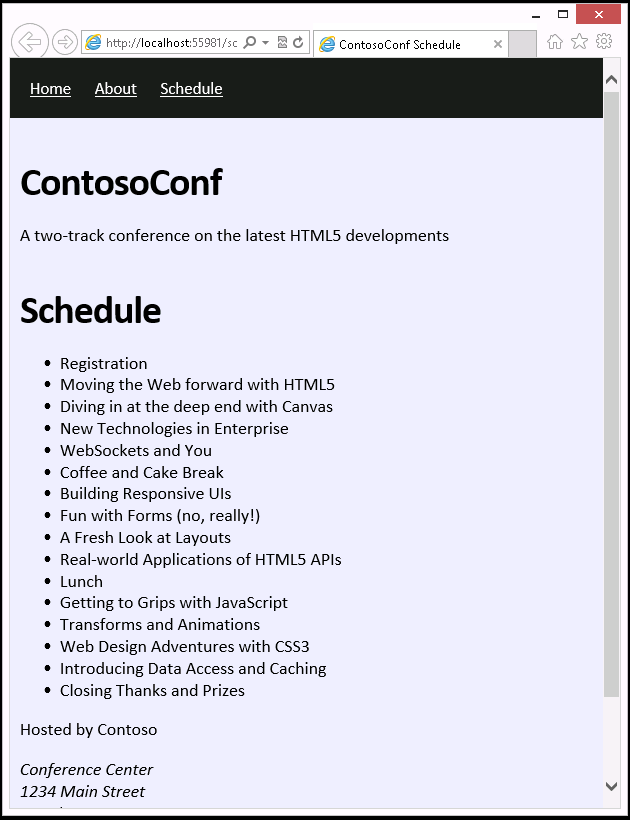
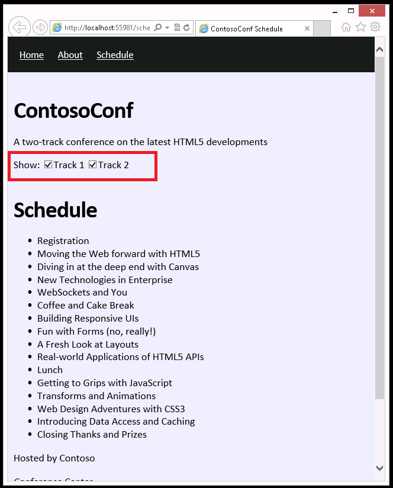

## Module 3: Introduction to JavaScript

## Lab: Displaying Data and Handling Events by Using JavaScript

#### Scenario

The conference being organized by ContosoConf consists of a number of sessions that are organized into tracks. A track groups sessions of related technologies, and conference attendees can view the sessions in a track to determine which ones may be of most interest to them.

To assist conference attendees, you have been asked to add a **Schedule** page that lists the tracks and sessions for the conference to the ContosoConf website. 

#### Objectives

After completing this lab, you will be able to:
- Use JavaScript code to programmatically update the data displayed on an HTML5 page.
- Handle the events that can occur when a user interacts with a page by using JavaScript.

#### Lab Setup

Estimated Time: **60 minutes**

### Exercise 1: Displaying Data Programmatically

#### Scenario

In this exercise, you will create the **Schedule** page that displays a list of sessions.

First, you will use the HTML5 DOM to obtain a reference to the page’s schedule list element. Then you will implement a function that creates list items (one list item for each session). Information about the sessions is stored in a file in JSON format. You will implement a function that reads this data and adds the details about each session to the list element. Finally, you will run the application and view the **Schedule** page to verify that it correctly displays the list of sessions.

#### Task 1: Review the existing code for the Schedule page

1.	Start Microsoft Visual Studio 2017, and then from the **Allfiles\Mod03\Labfiles\Starter\Exercise 1** folder, open the **ContosoConf.sln** solution.
2.	In the **ContosoConf** project, review the content of the **schedule.htm** page. Notice that the **schedule** page section, which will be used to display the list of sessions, currently contains an empty list  named **schedule**:
    ```html
        <section class="page-section schedule>
            <div class="container">
                <h1>Schedule</h1>
                <ul id="schedule"></ul>
            </div>
        </section>
    ```
3.	Notice that the **schedule.htm** page references the JavaScript code in the **scripts\pages\schedule.js** script file:
    ```html
        <script src="/scripts/pages/schedule.js" type="text/javascript"></script>
    ```
4.	Review the **scripts\pages\schedule.js** script file. This file contains the details of each session held in JSON format. The data is held in the **schedule** array, and each object in the array has three properties that specify the session id, the session title, and the tracks to which the session belongs (a session may be part of more than one track):
    ```javascript
        const schedule = [
            {
                "id": "session-1",
                "title": "Registration",
                "tracks": [1, 2]
            },
            {
                "id": "session-2",
                "title": "Moving the Web forward with HTML5",
                "tracks": [1, 2]
            },
            {
                "id": "session-3",
                "title": "Diving in at the deep end with Canvas",
                "tracks": [1]
            },
            {
                "id": "session-4",
                "title": "New Technologies in Enterprise",
                "tracks": [2]
            },
            ...
        ];
    ```

#### Task 2: Write code to get the schedule list element on the Schedule page

1.	In the **schedule.js** file, find the **TODO: Task 2** comment.
2.	Write a JavaScript code to get the **schedule** list element from the DOM and assign it to the *list* variable. You will use this variable to display the details of each session in the list on the **Schedule** page.
3. To find the list that has the **id** property set to **schedule**, use the **getElementById** method of the **document** object.

#### Task 3: Implement the createSessionElement function that creates the list item for a session

1.	In the **schedule.js** file, find the **TODO: Task 3** comment. This comment is located in the **createSessionElement** function, which looks like this:
    ```javascript
        function createSessionElement(session) {
            ...
        };
    ```
>**Note**: The purpose of the **createSessionElement** function is to create a list element that contains the name of the session passed in as the parameter.

2.	Add a JavaScript code to create a **&lt;li&gt;** element, set its text content to the session title, and then return the element.
3. To create a new **li** object, use the **createElement** method of the **document** object.
4. Set the **textContent** property of the **li** object to the **title** property of the **session** parameter passed in to the **createSessionElement** function.
5. Return the new **li** element.

#### Task 4: Implement the displaySchedule function that adds session items to the list for display

1.	In the **schedule.js** file, find the **TODO: Task 4** comment. This comment is located in the **displaySchedule** function, which looks like this:
    ```javascript
        function displaySchedule () {
            clearList();

            ...
        };
    ```
>**Note**: The purpose of the **displaySchedule** function is to display the title of each session in the list on the **Schedule** page.

2.	Add a JavaScript code to iterate over the **schedule** array, which contains the JSON data, by using a **for** loop. Create a **session** object for each item in the array, and then add the title of the session to the **list** element on the **Schedule** page.
3. To create a list item for each session, use the **createSessionElement** function that you implemented in Task 3.
4. To access the list element on the **Schedule** page, use the *list* variable that you created in Task 2.

#### Task 5: Run the web application and view the Schedule page

Run the application and view the **schedule.htm** page to verify that the list of sessions is displayed.



>**Note**: Remember that you can use the F12 Developer Tools in Microsoft Edge to debug your application. Also, if you make any changes to your code, make sure that you clear the browser cache before running the application again (press Ctrl+R in the F12 Developer Tools window). Otherwise, Microsoft Edge may attempt to run the previous version of your JavaScript code.


>**Results**: After completing this exercise, you will have added a **Schedule** page to the ContosoConf application that displays the details of conference sessions.

### Exercise 2: Handling Events

#### Scenario

In this exercise, you will add check boxes to the **Schedule** page to allow the user to specify the sessions to be displayed, according to the tracks that they are in.

First, you will add two check box HTML elements to the **Schedule** page. The first element will allow the user to specify that the sessions for track 1 should be listed. The second element will allow the user to specify that the sessions for track 2 should be listed. (If both check boxes are selected, then the sessions for both track 1 and track 2 will be listed.) Then you will add JavaScript code to handle the click events of these check boxes. To show only the sessions specified by using the check boxes, you will update the **displaySchedule** function. Finally, you will run the application and view the **Schedule** page to verify that selecting and clearing the check boxes correctly updates the session list.

#### Task 1: Add check box HTML elements

1.	In Visual Studio, from the **Allfiles\Mod03\LabFiles\Starter\Exercise 2** folder, open the **ContosoConf.sln** solution. This project contains a working version of the application as it should appear at the end of exercise 1.
2.	In the **schedule.htm** file, before the **schedule** list, add two check boxes that allow the user to specify the tracks for which the page should display session information:



3. Label the check boxes with the text **Track 1** and **Track 2**.
4. Set the **id** attributes of the check boxes to **show-track-1** and **show-track-2**.
5. Mark the check boxes as selected by default.

#### Task 2: Write code to get the check box elements from the Schedule page.

1.	From the **scripts\pages** folder, open the **schedule.js** file.
2.	After the *list* variable is defined, create two variables: *track1Checkbox* and *track2Checkbox*.
3.	Add a JavaScript code, to get the check box elements **show-track-1** and **show-track-2** from the DOM and reference them in these variables.
4. To get elements with the ids; **show-track-1** and **show-track-2**, use the **getElementById** method of the **document** object.

#### Task 3: Add click event listeners for each check box

1.	At the end of the **schedule.js** file, add an event listener for the click event of each check box. The event handler for each check box should call the **displaySchedule** function.
2. To add the event handler for each check box, use the **addEventListener** method.

#### Task 4: Update the displaySchedule function to display the sessions for selected tracks

1.	To add sessions to the list only when they are in the currently selected tracks, modify the **displaySchedule** function (one track, both tracks, or neither track might be selected).
2. To determine which track the user has selected, examine the **checked** property of the **track1Checkbox** and **track2Checkbox** elements.
3. The **session** parameter that passed in to the **createSessionElement** method has a **tracks** property. This property is an array that specifies which track or tracks a session belongs to.
4. To determine whether the **tracks** property specifies that a session is in track 1, track 2, or both, use the **indexOf** function.

#### Task 5: Run the web application and view the Schedule page

1.	Run the application and view the **schedule.htm** page.
2.	Verify that if both check boxes are selected, all tracks are listed.
3.	Verify that if only **Track 1** or **Track 2** is selected, only the sessions for that track are listed.
4.	Verify that if both tracks are not selected, no sessions are listed.

>**Note**: The sessions for Track 1 are:
>- Registration
>- Moving the Web forward with HTML5
>- Diving in at the deep end with Canvas
>- WebSockets and You
>- Coffee and Cake Break
>- Building Responsive UIs
>- A Fresh Look at Layout
>- Lunch
>- Getting to Grips with JavaScript
>- Web Design Adventures with CSS3
>- Closing Thanks and Prizes
>
>The sessions for Track 2 are:
>- Registration
>- Moving the Web forward with HTML5
>- New Technologies in Enterprise
>- Coffee and Cake Break
>- Fun with Forms (no, really!)
>- Real-world Applications of HTML5 APIs
>- Lunch
>- Transformations and Animations
>- Introducing Data Access and Caching
>- Closing Thanks and Prizes

>**Result**: After completing this exercise, you will have updated the **Schedule** page to filter sessions based on which tracks have been selected.

©2018 Microsoft Corporation. All rights reserved.

The text in this document is available under the [Creative Commons Attribution 3.0 License](https://creativecommons.org/licenses/by/3.0/legalcode), additional terms may apply. All other content contained in this document (including, without limitation, trademarks, logos, images, etc.) are **not** included within the Creative Commons license grant. This document does not provide you with any legal rights to any intellectual property in any Microsoft product. You may copy and use this document for your internal, reference purposes.

This document is provided &quot;as-is.&quot; Information and views expressed in this document, including URL and other Internet Web site references, may change without notice. You bear the risk of using it. Some examples are for illustration only and are fictitious. No real association is intended or inferred. Microsoft makes no warranties, express or implied, with respect to the information provided here.
